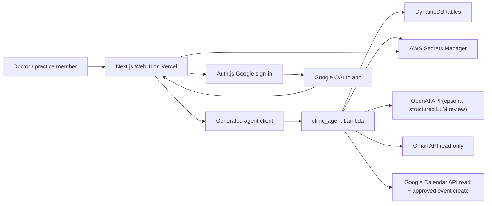
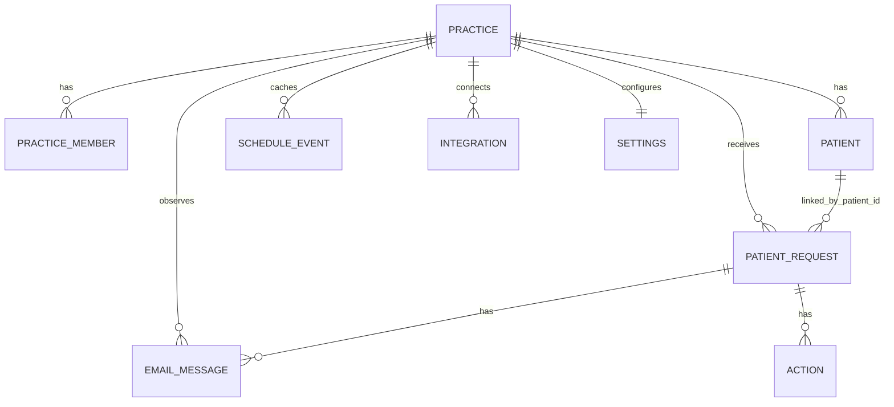
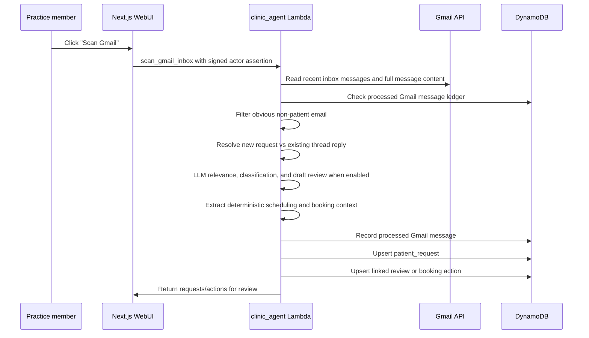
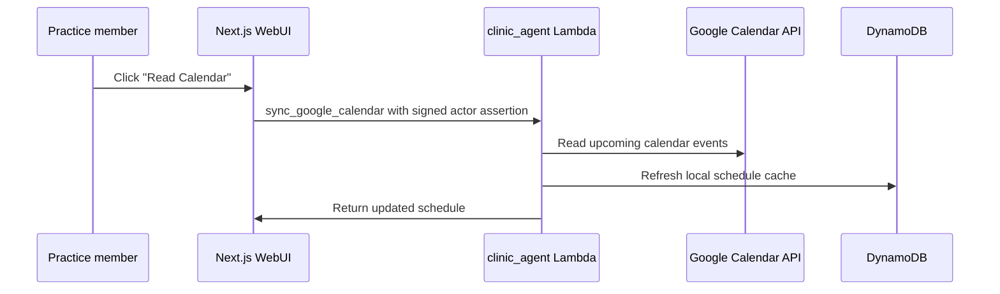
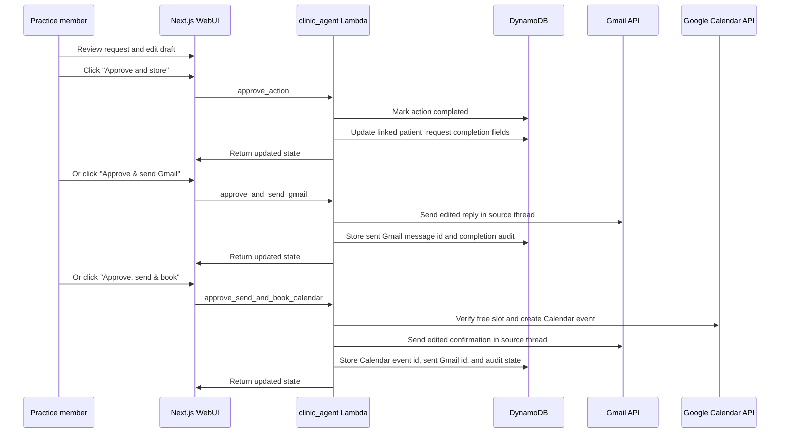

# Dr. Shalini Clinic App High-Level Design

Last updated: 2026-05-16

This document records the current product and system design for the clinic app.
It is meant to be readable by a new contributor, a future Codex session, or
future-you coming back after a break.

## Product Purpose

The app is a doctor-facing assistant for managing patient communication and
appointment-related requests.

The core idea is:

- Gmail is the source of patient communication.
- Google Calendar is the source of truth for appointments.
- The app reads Gmail and Calendar, organizes likely patient requests, drafts
  suggested replies, and keeps the doctor in control.
- Gmail messages are treated as events inside an ongoing patient request, not as
  separate requests by default.
- No external action is taken without explicit user approval.

The MVP is intentionally approval-first. It can scan, summarize, suggest, store
approval/audit state, and send Gmail replies only through the explicit
`Approve & send Gmail` path. It can also book an exact patient-selected slot in
Google Calendar only through the explicit `Approve, send & book` path. It does
not create Gmail drafts.

## Safety Contract

This is the most important design rule in the system:

- No email is sent without explicit user approval.
- No Gmail draft is created without explicit user approval.
- No calendar event is created, updated, deleted, or blocked without explicit
  user approval.
- `Approve and store` only records completed state and audit information.
- `Approve & send Gmail` sends the edited Gmail reply after explicit approval
  and records the sent message id.
- `Approve, send & book` creates the Google Calendar event for the exact
  patient-selected slot and sends the edited Gmail confirmation after explicit
  approval. Calendar invites are not sent; the patient communication remains the
  Gmail reply.
- Future external actions must be modeled as separate child actions and must
  require explicit approval.

This means the app can safely recommend text and availability windows, but it
cannot quietly act on behalf of the doctor.

## Current Architecture



Main components:

- `webUI/` is the Next.js app used by the doctor.
- `agents/clinic_agent/code/handler.py` is the main backend Lambda.
- `dynamodb/clinic_agent/*.json` defines the DynamoDB tables.
- `repo_tools/codegen.py` generates typed bindings for the web app and backend.
- GitHub Actions deploys DynamoDB, Lambda, IAM/OIDC, and Vercel.

## Identity And Practice Boundary

The app has two separate human concepts:

- Practice members are people who log into the app.
- Patients are people being treated or communicated with by the practice.

Patients are identified by `patient_id`. Login users are not patients.

Each login currently maps to a deterministic `practice_id`. The Next.js server
takes the signed-in email, creates a short-lived internal signature, and passes
that signed actor assertion to the Lambda. The Lambda verifies the signature
before deriving the `practice_id`.

The browser does not get to choose the practice boundary.

Current behavior:

- A new allowed login gets a clean practice workspace.
- Practice members are recorded in `clinic_practice_members` when Google is
  connected.
- New production practices do not receive Dr. Shalini demo data unless demo
  seeding is explicitly enabled.

Future direction:

- A practice invitation or membership table can allow multiple logins to share
  one existing practice.
- Role-based permissions can be added on top of `clinic_practice_members`.

## Core Data Model



### `clinic_patient_requests`

This is the main durable workflow entity.

Key:

- `practice_id`
- `patient_request_id`

It represents one patient-facing request or case, usually discovered from Gmail.
A request may contain multiple Gmail messages over time. For example, the first
email may ask for an appointment, the doctor may approve a reply with available
windows, and a later patient reply may select an exact slot. Those are all part
of the same `patient_request_id`.
Examples:

- A meet-and-greet request.
- An initial consultation request.
- A follow-up scheduling request.
- A patient asking for documents or next steps.

Important fields:

- `patient_id`
- `patient_email`
- `source_provider`
- `source_message_id`
- `source_thread_id`
- `request_type`
- `urgency_level`
- `risk_level`
- `requires_doctor_review`
- `suggested_next_action`
- `patient_emotional_tone`
- `status`
- `triage_reason`
- `triage_confidence`
- `proposed_windows`
- `draft_reply`
- `final_reply`
- `approved_at`
- `approved_by`

Design decision:

- This record should be durable. A later Gmail scan should update it, not delete
  it just because it did not appear in the latest limited Gmail result set.
- `source_thread_id` is used to attach later replies to the same request.
- `source_message_id` points at the latest relevant Gmail message for the
  request, while the full processed message trail is stored in
  `clinic_email_messages`.
- After the doctor sends proposed availability windows, the request moves to
  `awaiting_patient_slot_selection` instead of `completed`. A later patient
  reply in the same Gmail thread can then become a booking confirmation action.

### `clinic_email_messages`

This table is the Gmail message ledger and idempotency layer.

Key:

- `practice_id`
- `gmail_message_id`

Important fields:

- `gmail_thread_id`
- `message_id_header`
- `message_signature`
- `patient_request_id`
- `patient_id`
- `direction`
- `classification`
- `subject`
- `body_excerpt`
- `received_at`
- `processed_at`

Design decision:

- Every processed inbound or approved outbound Gmail message should be recorded
  here.
- If the same Gmail message id, RFC `Message-ID`, or normalized message
  signature appears again, the scanner treats it as already handled or a
  duplicate instead of creating a second request.
- This table lets the scanner distinguish a new request from a reply in an
  existing thread.

### `clinic_actions`

This table stores child workflow and audit actions.

Key:

- `clinic_id`
- `action_id`

Note: `clinic_id` currently stores the same value as `practice_id` for backward
compatibility with the original repo naming.

Important fields:

- `patient_request_id`
- `action_type`
- `status`
- `draft`
- `final`
- `approved_at`
- `approved_by`
- `metadata`

Design decision:

- `action_id` is not the same as `patient_request_id`.
- One patient request can have many actions.
- Future actions can include `create_gmail_draft`, `send_email`,
  `book_calendar_event`, `request_documents`, or `mark_follow_up`.

### `clinic_patients`

Stores known patients for a practice.

Key:

- `clinic_id`
- `patient_id`

Patients are separate from app login users. A patient may have email, phone, and
other clinical/admin metadata over time.

Current identity behavior:

- Gmail senders are matched to existing patients by normalized email address.
- If a clinic-relevant Gmail request comes from a new email address, the backend
  creates a deterministic `patient_id` and writes a new `clinic_patients`
  record before storing the request/action.
- The Patients tab timeline is derived from linked `clinic_patient_requests`;
  the durable request trail stays on the request entity rather than being copied
  into a separate timeline table.

### `clinic_practice_members`

Stores app users who belong to a practice.

Key:

- `practice_id`
- `member_email`

Important fields:

- `member_id`
- `display_name`
- `role`
- `status`
- `auth_provider`
- `first_login_at`
- `last_login_at`

Current role behavior is simple. The first connected user is effectively the
owner of their own practice workspace.

### `clinic_schedule`

Stores a local cache of Google Calendar events.

The app uses this table to understand busy/free time and produce availability
windows for patient replies.

The schedule API returns a rolling 14-day read-only view, including empty days,
so the UI can show complete weeks instead of only days that contain events.

The app writes to Google Calendar only through explicit approval actions. The
current write path creates a booked appointment after the doctor clicks
`Approve, send & book`.

### `clinic_integrations`

Stores safe integration metadata, such as:

- connected Google account email
- scopes granted
- provider status
- sync timestamps
- secret references

OAuth refresh tokens and access tokens are not stored in DynamoDB. Token
material lives in AWS Secrets Manager.

The default secret root is `shalini-clinic`. The Lambda appends
`practice_id/clinic_agent/google/<account>` so each practice gets its own token
path.

### `clinic_settings`

Stores practice preferences used by scheduling logic, such as:

- working days and hours
- lunch break
- appointment durations
- buffers between appointments
- tone/preferences for patient replies

## Gmail Request Flow



Current Gmail behavior:

- Lists recent inbox messages, then fetches full read-only message content.
- Checks `clinic_email_messages` first so already-seen Gmail messages and
  duplicate patient messages do not create duplicate requests.
- Uses Gmail `threadId`, RFC message headers, sender, patient id, and existing
  request state to decide whether a message starts a new request or belongs to
  an existing request.
- Filters obvious non-patient messages such as newsletters, no-reply senders,
  password resets, promotions, and generic marketing.
- When `OPENAI_API_KEY` is configured, sends a bounded structured review
  request to the configured OpenAI model. The LLM decides patient relevance,
  classifies the request, and writes the natural in-app draft reply. If the LLM
  is disabled, unavailable, or returns invalid JSON, the deterministic rules
  remain the fallback.
- Creates or updates `clinic_patient_requests`.
- Creates or updates a linked child action in `clinic_actions`.
- Classifies likely patient messages into triage categories such as appointment
  request, reschedule/cancellation, urgent clinical concern, routine clinical
  question, test/report/result query, prescription/admin request,
  billing/payment, and logistics.
- Stores urgency, risk level, whether doctor review is required, suggested next
  action, patient emotional tone, triage confidence, and triage reason.
- Stores patient-stated scheduling constraints and clinical context anchors,
  such as scan/test/procedure dates and times, in request metadata.
- For urgent clinical concern language, the app prepares an escalation-style
  draft and does not propose appointment availability windows.
- Drafts a suggested reply for review using the original patient message and
  extracted context. In the LLM path, the prompt requires a concise,
  patient-specific draft and forbids clinical advice or invented appointment
  times.
- If a patient replies in an existing thread with an exact selected slot, the app
  keeps the same `patient_request_id` and creates a booking confirmation action
  with `Approve, send & book`.
- If the reply only says something like `4.30pm works`, the app can resolve that
  against the previously proposed availability windows when there is a single
  unambiguous match.
- If a patient starts a fresh Gmail thread but uses the same sender email and
  clearly picks a time from exactly one open request's proposed windows, the app
  can still attach that reply to the waiting `patient_request_id`.
- Historical source messages from existing request threads are recorded in the
  Gmail message ledger but do not overwrite the current request state. This
  prevents old source emails from erasing proposed windows before a newer
  patient slot-selection reply is processed.
- Legacy `new_request` and `thread_reply` ledger records may be re-triaged
  while the linked request is still open, which lets the app repair stale
  generic drafts from an earlier classifier pass.
- Availability windows are only proposed when the message clearly asks to book,
  reschedule, or choose an appointment. In the LLM path, the LLM decides whether
  the reply should include availability, but the backend still generates the
  actual windows from Calendar/cache and patient constraints. Patient questions
  about results, prescriptions, symptoms, or general next steps receive
  contextual review drafts instead of generic appointment slots.
- Does not send email.
- Does not create Gmail drafts.
- Does not label, archive, or mutate Gmail messages.

## LLM Triage Design

The LLM boundary is deliberately narrow. It handles judgement and language; it
does not perform external actions.

LLM-based steps:

- Patient relevance: decide whether the Gmail message belongs in the patient
  workflow or should be ignored.
- Request classification: choose the request type, urgency, risk level,
  doctor-review requirement, emotional tone, confidence, and triage reason.
- Draft response: prepare a concise, contextual reply for the doctor to review.

Deterministic steps that stay in code:

- Gmail read and message/thread de-duplication.
- Patient identity lookup and `patient_id` creation.
- Gmail thread to `patient_request_id` continuity.
- Date/time parsing, slot constraints, and Calendar availability generation.
- Exact booking-candidate extraction and live Calendar availability checks.
- Gmail send and Calendar write actions, both behind explicit approval.

The backend stores LLM audit metadata on `request_constraints`, including
`llm_review_status`, `llm_model`, `llm_error`, `llm_patient_relevant`,
`llm_should_offer_availability`, and `llm_draft_used`.

Runtime configuration:

- `OPENAI_API_KEY`: enables the LLM review path when present.
- `CLINIC_LLM_ENABLED=false`: disables the LLM path even if a key exists.
- `CLINIC_LLM_MODEL`: optional model override; defaults to `gpt-5.4-nano`.

When enabled, the original patient email content is sent to the configured
OpenAI model for the three LLM review steps above. The prompt explicitly says
that no email is sent and no Calendar event is created until the doctor approves
inside the app.

## Rounds

The first app screen is `Rounds`, not a raw inbox. It is the daily cockpit for
the doctor and follows the warm cream, high-readability visual theme from
`weave_clinic_rounds_light_theme.html`. The light theme is an intentional
accessibility decision for overworked doctors who may find dark interfaces
tiring to read.

Current visual principles:

- Use warm cream (`#F7F3E8`) instead of pure white for the full-screen
  background.
- Use the light mockup's rounded phone canvas treatment over a warmer tan outer
  background.
- Use white for the main working surfaces that need attention, especially the
  Today Briefing card and open action cards.
- Use darker teal (`#0F6E56` and `#1D9E75`) for brand/action accents so the
  mint family still meets contrast expectations on cream.
- Keep a single dark navy serif `S` logo block as a brand signature, not as the
  overall color scheme.
- Use larger default type and medium text weight for body copy, names, section
  labels, and times.
- Use solid status-pill backgrounds, such as mint `#DCEFE6` and amber
  `#FAEEDA`, instead of transparent pastel washes.
- Keep 1px borders so cards remain visible under bright clinic lighting.
- Hide quiet zero-review states in the Rounds briefing.

It has two current responsibilities:

- Show a summary overview of the day, including appointment count, next
  appointment, open action count, clinical-review count, and scheduling action
  count.
- Show open actions that need attention, sorted so urgent and clinical-review
  items appear before routine admin/scheduling work.

Expanded request cards show the source email, triage, patient context, and an
editable draft reply. `Rounds` still uses the same approval-gated child actions.
Reviewing an action and clicking `Approve and store` only records the edited
final text and audit state. It does not send email, create Gmail drafts, or
change Google Calendar.

When a Gmail request contains an exact patient-selected date and time, the card
can also show `Approve, send & book`. That path verifies the slot against
Google Calendar, creates the Calendar event, sends the edited Gmail
confirmation, and records both external IDs for audit.

New empty practices see a first-run onboarding screen that guides the user
through Google connection, Calendar read, and Gmail scan. The screen disappears
after synced workspace data exists or the user chooses to open the empty
workspace.

## Calendar Flow



Current Calendar behavior:

- Reads Google Calendar events for the upcoming sync window.
- Stores busy events in `clinic_schedule`.
- Returns 14 calendar days, including empty days.
- The Schedule tab shows 7 days by default and lets the user move to the next
  week.
- Uses the local schedule cache when drafting replies.
- Creates a Calendar event only when the doctor clicks `Approve, send & book`
  for a Gmail-sourced action with an exact patient-selected slot.
- Does not update, delete, or block calendar events in the background.

## Availability Proposal Design

The app should avoid overly granular slot menus such as:

- `9:00-9:30`
- `9:30-10:00`
- `10:00-10:30`

Instead, it should propose human-friendly availability windows, such as:

- `Monday between 9:00 AM and 12:00 PM`
- `Tuesday between 10:30 AM and 12:00 PM`
- `Tuesday between 1:00 PM and 2:30 PM`

The patient can then reply with the exact time that works for them.

Availability windows are based on:

- doctor working hours
- lunch break
- buffer preferences
- appointment duration
- existing busy calendar events
- patient-stated constraints in the email
- clinical context anchors in the email

Examples of patient constraints:

- next week
- weekday only
- morning
- afternoon
- lunchtime
- after 3 PM
- before noon
- between two times
- after a scan/test/procedure

Clinical context anchors are treated conservatively. For example, if a patient
says their scan is on 15 May at 3:00 PM and asks for a follow-up afterwards,
the app can propose windows from 4:30 PM on 15 May onward, assuming the doctor
is free. If the patient gives only the date with no time, the app avoids
same-day proposals and starts from the following day.

Current appointment duration assumptions:

- Meet and greet: 15 minutes
- Initial consultation: 45 minutes
- Follow-up: 20 minutes

## Approval Flow



Current approval behavior:

- Stores the final edited text.
- Marks the child action as completed.
- Updates the linked patient request when relevant.
- Preserves audit fields.
- For Gmail-sourced actions only, `approve_and_send_gmail` sends the edited
  message through Gmail after the doctor clicks the send-specific approval
  button, then records the Gmail sent message id on the action.
- If that approved send contains proposed availability windows, the linked
  request is marked `awaiting_patient_slot_selection`, not completed.
- For Gmail-sourced actions with an exact patient-selected slot,
  `approve_send_and_book_calendar` creates the Google Calendar event and sends
  the edited Gmail confirmation after the doctor clicks the booking-specific
  approval button.

Current approval does not:

- create a Gmail draft
- update, delete, or block existing calendar events

Email and Calendar writes are deliberately isolated to explicit approval paths.

## Authentication And Google OAuth

Auth uses Auth.js/NextAuth v4.

The same Google OAuth app is used for:

- Google sign-in
- requesting Gmail/Calendar access for the approved workflows

The OAuth client ID and client secret are app-level credentials. They are not
different for each user. Different users sign in through the same Google OAuth
app, then the app stores their connection metadata under their own practice.

Current Google scopes:

- `openid`
- `email`
- `https://www.googleapis.com/auth/calendar.events.readonly`
- `https://www.googleapis.com/auth/calendar.events`
- `https://www.googleapis.com/auth/gmail.readonly`
- `https://www.googleapis.com/auth/gmail.compose`

`gmail.compose` is present because approve-and-send is now implemented as a
separate explicit approval action. Existing users must reconnect Google to grant
the new scope before sending.

`calendar.events` is present because exact-slot booking is now implemented as a
separate explicit approval action. Existing users must reconnect Google to
grant the new scope before booking.

## Production And Mock Boundaries

Production:

- Next.js runs on Vercel.
- Backend agent runs as AWS Lambda.
- DynamoDB stores durable app data.
- AWS Secrets Manager stores Google token material.
- Vercel invokes Lambda using AWS OIDC credentials.
- Deploys run through GitHub Actions.

Local/development:

- The web app can use generated mock agents for local UI work.
- Mock data is for development only.
- Production new-practice seeding is disabled by default.

## Deployment Model

Current repo:

- Fork: `https://github.com/suhanisho/infiapp`
- Branch: `build-clinic-mvp`
- Production app: `https://shalini-clinic-webui.vercel.app`
- Deploy workflow: `.github/workflows/deploy.yml`

Deploys are triggered manually from GitHub Actions against `build-clinic-mvp`.

The deploy workflow updates:

- DynamoDB table definitions
- Lambda function code and environment
- IAM/OIDC access needed by Vercel
- Vercel project and environment
- Vercel production deployment

## Extension Points

The current design is intentionally extensible around `patient_request_id`.

Near-term extensions:

- Better patient email classification.
- Patient matching for unknown senders.
- A review panel explaining why an email was included or ignored.
- More request types, such as documents, prescriptions, referrals, or forms.

Future approval-gated actions:

- Create Gmail draft.
- Hold calendar slot.
- Reschedule or cancel an existing calendar appointment.
- Ask patient for missing information.
- Mark request for follow-up.

Future multi-user work:

- Add invitations.
- Allow multiple practice members to share the same practice.
- Add roles such as owner, doctor, assistant, and read-only.
- Track who approved each external action.

## Current Non-Goals

The current MVP does not:

- create Gmail drafts
- label, archive, or delete Gmail threads
- update, delete, or silently hold Google Calendar events
- auto-book appointments
- make medical decisions
- replace the doctor review step

The app is an assistant and organizer, not an autonomous actor.

## Validation Commands

Run these before committing meaningful backend/frontend changes:

```sh
python3.11 -m repo_tools validate-agents
python3.11 -m repo_tools validate-db
python3.11 -m repo_tools codegen-check
python3.11 -m repo_tools test-agents
python3.11 -m repo_tools typecheck-agents
npm --prefix webUI run build
```
