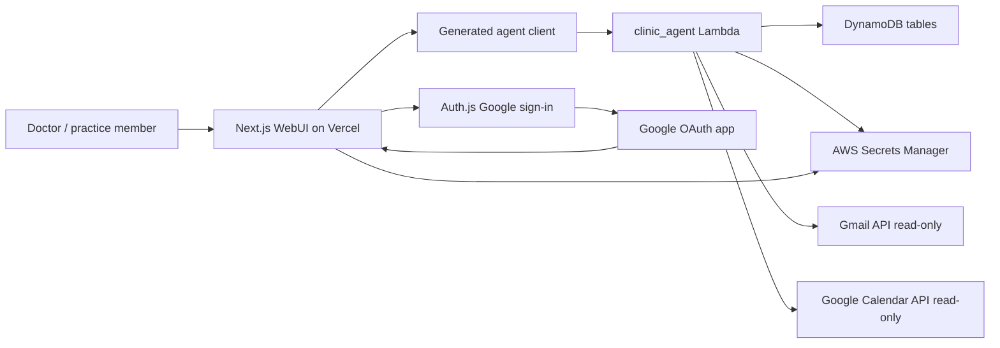
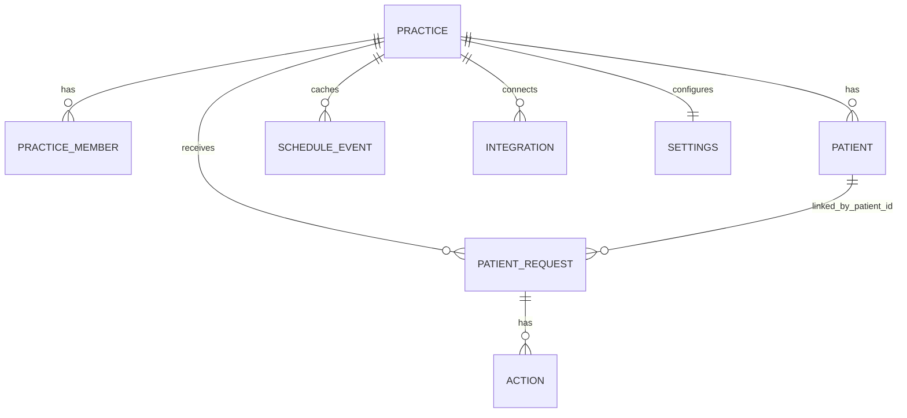
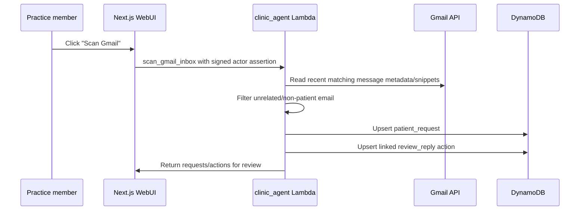
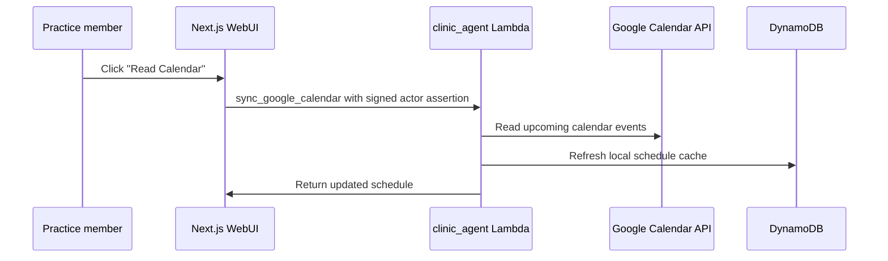
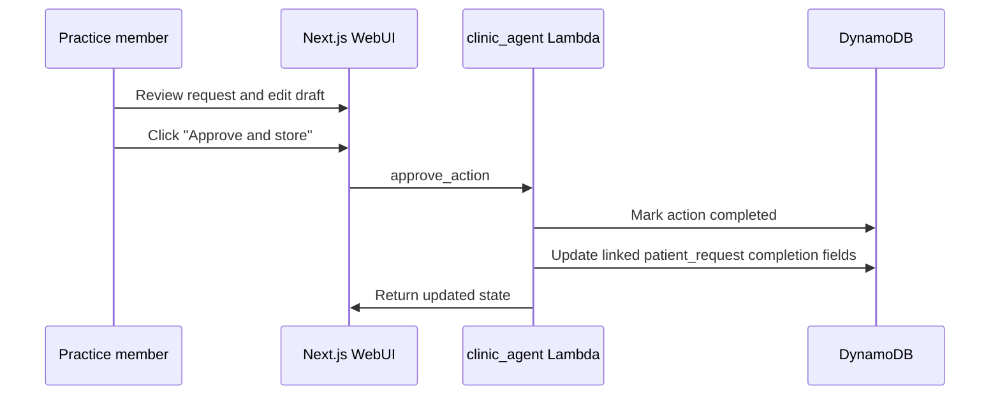

# Dr. Shalini Clinic App High-Level Design

Last updated: 2026-05-07

This document records the current product and system design for the clinic app.
It is meant to be readable by a new contributor, a future Codex session, or
future-you coming back after a break.

## Product Purpose

The app is a doctor-facing assistant for managing patient communication and
appointment-related requests.

The core idea is:

- Gmail is the source of patient communication.
- Google Calendar is the source of truth for appointments.
- The app reads Gmail and Calendar, organizes likely patient requests, drafts
  suggested replies, and keeps the doctor in control.
- No external action is taken without explicit user approval.

The MVP is intentionally read-first. It can scan, summarize, suggest, and store
approval/audit state. It does not send emails, create Gmail drafts, or write to
Google Calendar.

## Safety Contract

This is the most important design rule in the system:

- No email is sent without explicit user approval.
- No Gmail draft is created without explicit user approval.
- No calendar event is created, updated, deleted, or blocked without explicit
  user approval.
- Current approvals only store completed state and audit information in the
  backend.
- Future external actions must be modeled as separate child actions and must
  require explicit approval.

This means the app can safely recommend text and availability windows, but it
cannot quietly act on behalf of the doctor.

## Current Architecture



Main components:

- `webUI/` is the Next.js app used by the doctor.
- `agents/clinic_agent/code/handler.py` is the main backend Lambda.
- `dynamodb/clinic_agent/*.json` defines the DynamoDB tables.
- `repo_tools/codegen.py` generates typed bindings for the web app and backend.
- GitHub Actions deploys DynamoDB, Lambda, IAM/OIDC, and Vercel.

## Identity And Practice Boundary

The app has two separate human concepts:

- Practice members are people who log into the app.
- Patients are people being treated or communicated with by the practice.

Patients are identified by `patient_id`. Login users are not patients.

Each login currently maps to a deterministic `practice_id`. The Next.js server
takes the signed-in email, creates a short-lived internal signature, and passes
that signed actor assertion to the Lambda. The Lambda verifies the signature
before deriving the `practice_id`.

The browser does not get to choose the practice boundary.

Current behavior:

- A new allowed login gets a clean practice workspace.
- Practice members are recorded in `clinic_practice_members` when Google is
  connected.
- New production practices do not receive Dr. Shalini demo data unless demo
  seeding is explicitly enabled.

Future direction:

- A practice invitation or membership table can allow multiple logins to share
  one existing practice.
- Role-based permissions can be added on top of `clinic_practice_members`.

## Core Data Model



### `clinic_patient_requests`

This is the main durable workflow entity.

Key:

- `practice_id`
- `patient_request_id`

It represents one patient-facing request or case, usually discovered from Gmail.
Examples:

- A meet-and-greet request.
- An initial consultation request.
- A follow-up scheduling request.
- A patient asking for documents or next steps.

Important fields:

- `patient_id`
- `patient_email`
- `source_provider`
- `source_message_id`
- `source_thread_id`
- `request_type`
- `urgency_level`
- `risk_level`
- `requires_doctor_review`
- `suggested_next_action`
- `patient_emotional_tone`
- `status`
- `triage_reason`
- `triage_confidence`
- `proposed_windows`
- `draft_reply`
- `final_reply`
- `approved_at`
- `approved_by`

Design decision:

- This record should be durable. A later Gmail scan should update it, not delete
  it just because it did not appear in the latest limited Gmail result set.

### `clinic_actions`

This table stores child workflow and audit actions.

Key:

- `clinic_id`
- `action_id`

Note: `clinic_id` currently stores the same value as `practice_id` for backward
compatibility with the original repo naming.

Important fields:

- `patient_request_id`
- `action_type`
- `status`
- `draft`
- `final`
- `approved_at`
- `approved_by`
- `metadata`

Design decision:

- `action_id` is not the same as `patient_request_id`.
- One patient request can have many actions.
- Future actions can include `create_gmail_draft`, `send_email`,
  `book_calendar_event`, `request_documents`, or `mark_follow_up`.

### `clinic_patients`

Stores known patients for a practice.

Key:

- `clinic_id`
- `patient_id`

Patients are separate from app login users. A patient may have email, phone, and
other clinical/admin metadata over time.

### `clinic_practice_members`

Stores app users who belong to a practice.

Key:

- `practice_id`
- `member_email`

Important fields:

- `member_id`
- `display_name`
- `role`
- `status`
- `auth_provider`
- `first_login_at`
- `last_login_at`

Current role behavior is simple. The first connected user is effectively the
owner of their own practice workspace.

### `clinic_schedule`

Stores a local read-only cache of Google Calendar events.

The app uses this table to understand busy/free time and produce availability
windows for patient replies.

The app does not write back to Google Calendar in the MVP.

### `clinic_integrations`

Stores safe integration metadata, such as:

- connected Google account email
- scopes granted
- provider status
- sync timestamps
- secret references

OAuth refresh tokens and access tokens are not stored in DynamoDB. Token
material lives in AWS Secrets Manager.

The default secret root is `shalini-clinic`. The Lambda appends
`practice_id/clinic_agent/google/<account>` so each practice gets its own token
path.

### `clinic_settings`

Stores practice preferences used by scheduling logic, such as:

- working days and hours
- lunch break
- appointment durations
- buffers between appointments
- tone/preferences for patient replies

## Gmail Request Flow



Current Gmail behavior:

- Reads recent Gmail messages matching clinic-oriented terms.
- Filters obvious non-patient messages such as newsletters, no-reply senders,
  password resets, promotions, and generic marketing.
- Creates or updates `clinic_patient_requests`.
- Creates or updates a linked child action in `clinic_actions`.
- Classifies likely patient messages into triage categories such as appointment
  request, reschedule/cancellation, urgent clinical concern, routine clinical
  question, test/report/result query, prescription/admin request,
  billing/payment, and logistics.
- Stores urgency, risk level, whether doctor review is required, suggested next
  action, patient emotional tone, triage confidence, and triage reason.
- For urgent clinical concern language, the app prepares an escalation-style
  draft and does not propose appointment availability windows.
- Drafts a suggested reply for review.
- Does not send email.
- Does not create Gmail drafts.
- Does not label, archive, or mutate Gmail messages.

## Daily Cockpit

The first app screen is the Daily Cockpit, not a raw inbox.

It has two current responsibilities:

- Show a summary overview of the day, including appointment count, next
  appointment, open action count, clinical-review count, and scheduling action
  count.
- Show open actions that need attention, sorted so urgent and clinical-review
  items appear before routine admin/scheduling work.

The cockpit still uses the same approval-gated child actions. Reviewing an
action and clicking `Approve and store` only records the edited final text and
audit state. It does not send email, create Gmail drafts, or change Google
Calendar.

## Calendar Flow



Current Calendar behavior:

- Reads Google Calendar events for the upcoming sync window.
- Stores busy events in `clinic_schedule`.
- Uses the local schedule cache when drafting replies.
- Does not create, update, delete, or block calendar events.

## Availability Proposal Design

The app should avoid overly granular slot menus such as:

- `9:00-9:30`
- `9:30-10:00`
- `10:00-10:30`

Instead, it should propose human-friendly availability windows, such as:

- `Monday between 9:00 AM and 12:00 PM`
- `Tuesday between 10:30 AM and 12:00 PM`
- `Tuesday between 1:00 PM and 2:30 PM`

The patient can then reply with the exact time that works for them.

Availability windows are based on:

- doctor working hours
- lunch break
- buffer preferences
- appointment duration
- existing busy calendar events
- patient-stated constraints in the email

Examples of patient constraints:

- next week
- weekday only
- morning
- afternoon
- lunchtime
- after 3 PM
- before noon
- between two times

Current appointment duration assumptions:

- Meet and greet: 15 minutes
- Initial consultation: 45 minutes
- Follow-up: 20 minutes

## Approval Flow



Current approval behavior:

- Stores the final edited text.
- Marks the child action as completed.
- Updates the linked patient request when relevant.
- Preserves audit fields.

Current approval does not:

- send an email
- create a Gmail draft
- create or update a calendar event

This is deliberate. External side effects will be separate approval-gated
actions later.

## Authentication And Google OAuth

Auth uses Auth.js/NextAuth v4.

The same Google OAuth app is used for:

- Google sign-in
- requesting read-only Gmail/Calendar access

The OAuth client ID and client secret are app-level credentials. They are not
different for each user. Different users sign in through the same Google OAuth
app, then the app stores their connection metadata under their own practice.

Current Google scopes:

- `openid`
- `email`
- `https://www.googleapis.com/auth/calendar.events.readonly`
- `https://www.googleapis.com/auth/gmail.readonly`

Future Gmail draft/send scope:

- `https://www.googleapis.com/auth/gmail.compose`

Do not add `gmail.compose` until create-draft and send-email are implemented as
separate explicit approval actions.

## Production And Mock Boundaries

Production:

- Next.js runs on Vercel.
- Backend agent runs as AWS Lambda.
- DynamoDB stores durable app data.
- AWS Secrets Manager stores Google token material.
- Vercel invokes Lambda using AWS OIDC credentials.
- Deploys run through GitHub Actions.

Local/development:

- The web app can use generated mock agents for local UI work.
- Mock data is for development only.
- Production new-practice seeding is disabled by default.

## Deployment Model

Current repo:

- Fork: `https://github.com/suhanisho/infiapp`
- Branch: `build-clinic-mvp`
- Production app: `https://shalini-clinic-webui.vercel.app`
- Deploy workflow: `.github/workflows/deploy.yml`

Deploys are triggered manually from GitHub Actions against `build-clinic-mvp`.

The deploy workflow updates:

- DynamoDB table definitions
- Lambda function code and environment
- IAM/OIDC access needed by Vercel
- Vercel project and environment
- Vercel production deployment

## Extension Points

The current design is intentionally extensible around `patient_request_id`.

Near-term extensions:

- Better patient email classification.
- Patient matching for unknown senders.
- A review panel explaining why an email was included or ignored.
- More request types, such as documents, prescriptions, referrals, or forms.

Future approval-gated actions:

- Create Gmail draft.
- Send Gmail draft.
- Hold calendar slot.
- Book calendar appointment.
- Ask patient for missing information.
- Mark request for follow-up.

Future multi-user work:

- Add invitations.
- Allow multiple practice members to share the same practice.
- Add roles such as owner, doctor, assistant, and read-only.
- Track who approved each external action.

## Current Non-Goals

The current MVP does not:

- send patient emails
- create Gmail drafts
- mutate Gmail threads
- create or edit Google Calendar events
- auto-book appointments
- make medical decisions
- replace the doctor review step

The app is an assistant and organizer, not an autonomous actor.

## Validation Commands

Run these before committing meaningful backend/frontend changes:

```sh
python3.11 -m repo_tools validate-agents
python3.11 -m repo_tools validate-db
python3.11 -m repo_tools codegen-check
python3.11 -m repo_tools test-agents
python3.11 -m repo_tools typecheck-agents
npm --prefix webUI run build
```
